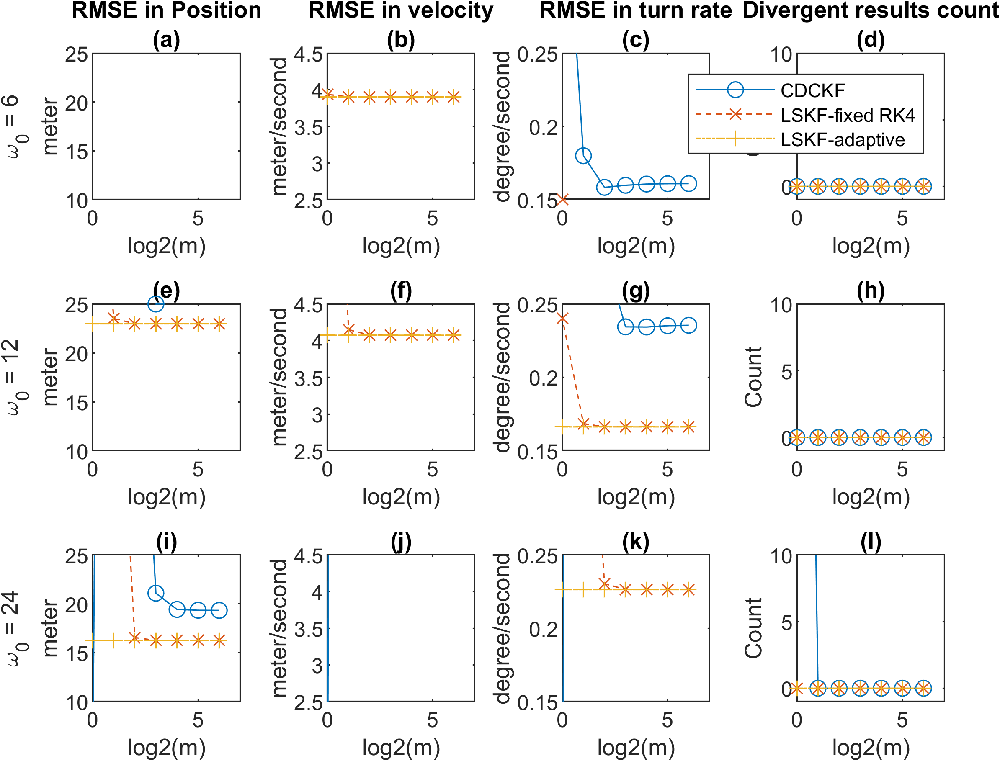

# the level set Kalman filter implemented in matlab
This repository contains an implementation of the level set Kalman filter, as described in https://arxiv.org/abs/2103.11130 It also contains the trajectory tracking test case in the manuscript.
## Basic usage
For generating the figures that compare the Root mean-squared error (RMSE) as shown in the manuscript, just run ``get_RMSE_panels_${x}sec_script.m`` where ``x=2,3,4,6`` Note the axes are not set automatically, so the datapoints can appear outside of the plotted range by default. To change that, use ``nexttile(${y});axis([xllim xhlim yllim yhlim])`` with appropiate range for each figure tiles.

## Files in repository
The files attached are all ``matlab`` codes. Here we give a brief overview of the functions of each file. For more detailed description, refer to the comments in the file. The files can be categorized as follows:
* classes
  * ``continuous_discrete_model_cls.m``: A class that contains the description of a continuous discrete model, including the dynamics, noise level, observation function, and others.
  * ``instance_parameter_cls.m``: A class that contains additional parameters that affects the level set Kalman filter method, but not part of the model
  * ``mean_covariance_sqrt_cls.m``: A class that defines the multivariate normal distribution
* functions
  * ``advdiffvel_mc_avg.m``: Finds the velocity for ``mean_covariance_sqrt_cls.m``
  * ``continuous_discrete_cubature_kalman_filter.m, coordinated_turn_cubature_predict_wrap.m``: Part of an implentation for the continuous discrete cubarture kalman filter, which is used in comarison
  * ``diffvel.m``: Internal function for finding diffusion velocity
  * ``euler_maruyama.m, gen_traj_and_meas.m, get_instance_parameter.m, get_test_model.m``: Used for generating simulated trajectories
  * ``level_set_filter.m``: Applies the level set kalman filter given an initial state, measurements, a continuous discrete model, and additional parameters.
  * ``ode2.m, ode4.m, ode_wrap.m``: Auxiliary functions related to solving ordinary differential equations
  * ``run_test_case.m``: A high level wrapper that runs the simulation, and finds the RMSE given initial condition, measurements and true positions. 
  * ``square_root_cubature_measurement_update.m``: The function that performs the measurement update
* scripts
  * ``get_RMSE_panels_${x}sec_script.m``: generating the figures that compare the Root mean-squared error (RMSE) as shown in the manuscript
  * ``compare_test_case_script.m``: generating a single tile as shown in ``get_RMSE_panels_${x}sec_script.m``
